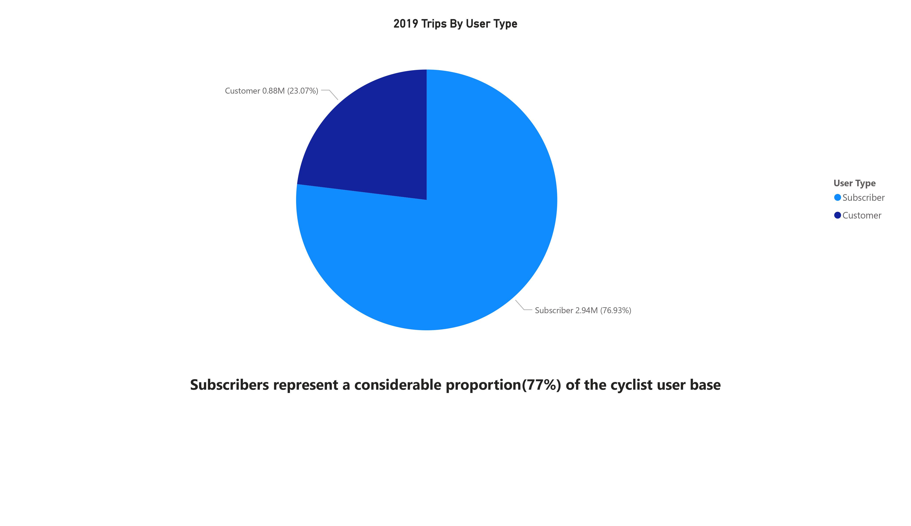

# Executive Summary

Cyclistic, a bike-share program with a diverse range of offerings, aims to maximize annual memberships for sustained growth. This report analyzes user data and provides recommendations to convert casual riders into subscribers, focusing on enhancing financial viability.

# Background

Cyclistic is a bike-share company launched in 2016, growing to a fleet of 5800 bicycles in 600 docking stations across Chicago. The initial marketing strategy of the company focused on flexible pricing plans for single-ride passes, full-day passes, and annual memberships. Annual members are identified as more profitable than casual riders, prompting a strategic shift to convert existing casual riders into members. The goal is to understand the differences between casual riders and annual members using historical bike trip data, providing valuable insights for the marketing team.

# Business Task

The business task is to maximize annual memberships for sustained growth by converting casual riders into subscribers. This involves analyzing historical bike trip data to identify patterns, trends, and key differences between casual riders and annual members. The ultimate goal is to present a comprehensive report with actionable recommendations based on the analysis, including documentation of data manipulation process, visualizations, key findings, and recommendations.

# Data Collection and Organization

For this analysis, the Cyclistic 2019 trip data provided by Motivate International Inc. was utilized. The data is available for download on the [divvy_tripdata website](https://divvy-tripdata.s3.amazonaws.com/index.html). Due to data privacy regulations, personally identifiable information about riders is not used in the analysis.

All four quarters of the 2019 data were acquired for this analysis, each represented by a separate file. The data schema remains consistent across all four files, including several rows of observations and 12 columns: "trip_id", "start_time", "end_time", "bikeid", "tripduration", "from_station_id", "from_station_name", "to_station_id", "to_station_name", "usertype", "gender", and "birthyear".
# Data Manipulation and Processing

The process involved the use of SQL Server Management Studio 19, accessible at [SQL Server Management Studio](https://learn.microsoft.com/en-us/sql/ssms/download-sql-server-management-studio-ssms?view=sql-server-ver16). All four files (Q1-Q4) containing the 2019 data were imported through the graphical user interface (GUI), resulting in 3,818,004 rows of observations after merging.

The "usertype" column presented two data types: "Customer" and "Subscriber," where "Customer" signifies casual users and "Subscriber" refers to members. For this analysis, the column has been retained as is, with "Customer" denoting casual users and "Subscriber" representing members.

To gain additional insights, new columns were calculated. The "start_time" and "end_time" columns, initially in date and time data types (DATETIME), were split into separate date and time columns. Two new columns, "day_of_week" and "ride_length_minutes" were introduced. Four columns, namely "from_station_name", "to_station_name", "start_time" and "end_time" were removed for streamlining the analysis. The final schema comprises 14 columns: "trip_id", "bikeid", "tripduration", "from_station_id", "to_station_id", "usertype", "gender", "birthyear", "start_date_new", "start_time_new", "end_date_new", "end_time_new", "day_of_week" and "ride_length_minutes".

For a detailed account of the entire manipulation and processing procedure, refer to the [Divvy_Trips_2019_Cleaning.sql](Divvy_Trips_2019_Cleaning.sql) file.

# Analysis and Visualization

Microsoft Power BI was employed for this stage. The data, finalized after the cleaning process, was directly imported into the Microsoft Power BI Desktop application. The following presents an analysis of the relationship between subscribers and customers, supported by visualizations.

The chart illustrates a clear dominance of subscribers, accounting for 73% of the user base, while customers make up the remaining 23%.

The third quarter stands out as the peak, demonstrating the highest user engagement, followed closely by the second quarter. This pattern suggest increased activity during these quarters.

The month-to-month user engagement chart indicates a significant surge in activity, commencing in May and reaching its peak in August, followed by a gradual decline through October. This pattern strongly supports a seasonal trend, with heightened engagement during the summer and fall months compared to other seasons.The rise in activity aligns with expectations of increased outdoor activites and favorable weather conditions.

The side-by-side bar graphs provide insights into user behavior within Cyclistic. The subscribers' graph reveals higher ride frequency during weekdays, suggesting a predominant use of bikes for commuting or work-related purposes. In contrast, the customers' graph illustrates increased usage during weekends, indicating a preference for recreational bike rides. 

The analysis of average ride length in minutes reveals a substantial distinction between customers and subscribers within Cyclistic. Notably, customers, on average, have ride duration nearly four times longer than those of subscribers.This suggests that customers have a preference for longer rides.

Subscribers, on average, maintain a consistent duration of around 14 minutes with slight variations across days. In contrast, customers exhibit a substantially higher average of around 57 minutes. This observation further supports the notion that customers have a preference for longer rides.

Subscribers exhibit a rapid peak in activity at 8 am and another surge around 5 pm, with a fairly consistent usage in between. In contrast, customers show increased activity from 9 am, peaking around 5 pm, and tapering off by 9 pm. This reinforces the earlier observation, that subscribers maintain a more consistent engagement, potentially associated with work-related commuting, while customers lean towards leisurely rides.

# Summary

The analysis of Cyclistic bike-share data reveals the following key insights:

- **User Composition:** Subscribers make up 73%, while customers comprise 23% of the user base.
- **Seasonal Usage:** Higher user engagement is observed during summer and fall.
- **Weekday vs. Weekend:** Subscribers favor weekdays, possibly for commuting, while customers show more weekend activity.
- **Average Ride Length:** Customers take significantly longer rides (57 minutes) compared to subscribers (14 minutes).
- **Ride Length by Day:** Subscribers maintain consistent ride durations, while customers prefer longer rides.
- **Hourly Activity Patterns:** Subscribers peak at 8 am and 5 pm, possibly linked to work, while customers peak from 9 am to 5 pm, indicating leisurely rides.

# Recommendations

1. **Incentivize Longer Rides for Annual Memberships:**
   Recognizing that casual riders (customers) prefer longer rides, the annual membership plan should incorporate incentives or special offers for extended durations to attract and retain this user segment.

2. **Explore Quarterly Subscription Payments:**
   Given the higher user engagement observed in the second and third quarters, consider introducing a quarterly subscription payment model. Allowing customers to make annual payments on a quarterly basis, rather than as a one-time payment, may enhance customer adoption.

3. **Weekend Marketing Promotions:**
   Capitalize on the observed trend of increased bike usage by customers on weekends. Implement targeted marketing promotions and special discounts specifically tailored for weekend rides to boost customer participation during this timeframe.
